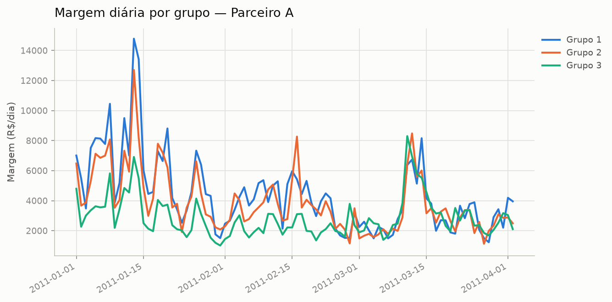

# Teste A/B — Parceiro A

## Resumo executivo

- **Decisão: manter Grupo 1** — Grupo 2 teve desempenho pior, com significância estatística (confiança alta).
- **Decisão: manter Grupo 1** — Grupo 3 teve desempenho pior, com significância estatística (confiança alta).

## Racional

### Grupo 1 vs Grupo 2

No período comparável (92 dias pareados), Grupo 2 gerou em média R$ 512,96 de margem por dia a menos que Grupo 1 (intervalo de 95% de confiança: -R$ 743,79 a -R$ 282,12).

Próximo teste sugerido: os patamares de cashback já testados neste histórico vão até 6.8%, em passos de ~1.4% — considere testar um próximo patamar por volta de 8.2%, mantendo o incremento já validado no próprio histórico.

Do ponto de vista de risco: há 100% de chance de Grupo 1 ser melhor; se escalássemos Grupo 2 por engano, a perda esperada seria de R$ 513,20/dia.

_após correção de Benjamini-Hochberg para múltiplas comparações (t ajustado=0.0000, Wilcoxon ajustado=0.0000): diferença média de -512.96 é estatisticamente significativa._

### Grupo 1 vs Grupo 3

No período comparável (92 dias pareados), Grupo 3 gerou em média R$ 1.526,35 de margem por dia a menos que Grupo 1 (intervalo de 95% de confiança: -R$ 1.919,60 a -R$ 1.133,09).

Próximo teste sugerido: os patamares de cashback já testados neste histórico vão até 6.8%, em passos de ~1.4% — considere testar um próximo patamar por volta de 8.2%, mantendo o incremento já validado no próprio histórico.

Do ponto de vista de risco: há 100% de chance de Grupo 1 ser melhor; se escalássemos Grupo 3 por engano, a perda esperada seria de R$ 1.526,76/dia.

_após correção de Benjamini-Hochberg para múltiplas comparações (t ajustado=0.0000, Wilcoxon ajustado=0.0000): diferença média de -1526.35 é estatisticamente significativa._

## Ressalvas

- [INFO] pico_sincronizado (Parceiro A): pico simultâneo em todos os 3 grupos entre 2011-01-08 e 2011-01-08 (1 dia(s)) — provável evento externo (sazonalidade, campanha), não efeito do teste.
- [INFO] pico_sincronizado (Parceiro A): pico simultâneo em todos os 3 grupos entre 2011-01-11 e 2011-01-11 (1 dia(s)) — provável evento externo (sazonalidade, campanha), não efeito do teste.
- [INFO] pico_sincronizado (Parceiro A): pico simultâneo em todos os 3 grupos entre 2011-01-13 e 2011-01-13 (1 dia(s)) — provável evento externo (sazonalidade, campanha), não efeito do teste.

## Apêndice técnico

- **Grupo 1 vs Grupo 2** (coluna: `margem`, n=92)
  - teste t pareado: estatística=-4.414, p=0.0000
  - Wilcoxon: estatística=1084.500, p=0.0000
  - IC95 da diferença: (-743.79, -282.12)
  - médias: baseline=4399.03, variante=3886.08
  - camada bayesiana (prior de Jeffreys, posterior Student-t): P(μ>0)=0.0000, IC95 credível=(-743.79, -282.12), perda esperada de escalar=513.20, perda esperada de manter=0.00
  - correção Benjamini-Hochberg (múltiplas comparações): t ajustado=0.0000, Wilcoxon ajustado=0.0000, significativo após correção=True
  - bootstrap em bloco (2000 reamostragens, bloco=5 dias): IC95=(-795.71, -226.88), contém zero=False

- **Grupo 1 vs Grupo 3** (coluna: `margem`, n=92)
  - teste t pareado: estatística=-7.710, p=0.0000
  - Wilcoxon: estatística=501.000, p=0.0000
  - IC95 da diferença: (-1919.60, -1133.09)
  - médias: baseline=4399.03, variante=2872.68
  - camada bayesiana (prior de Jeffreys, posterior Student-t): P(μ>0)=0.0000, IC95 credível=(-1919.60, -1133.09), perda esperada de escalar=1526.76, perda esperada de manter=0.00
  - correção Benjamini-Hochberg (múltiplas comparações): t ajustado=0.0000, Wilcoxon ajustado=0.0000, significativo após correção=True
  - bootstrap em bloco (2000 reamostragens, bloco=5 dias): IC95=(-2244.45, -818.21), contém zero=False
