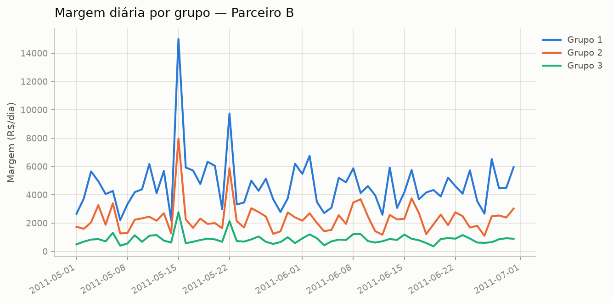

# Teste A/B — Parceiro B

## Resumo executivo

- **Decisão: manter Grupo 1** — Grupo 2 teve desempenho pior, com significância estatística (confiança alta).
- **Decisão: manter Grupo 1** — Grupo 3 teve desempenho pior, com significância estatística (confiança alta).

## Racional

### Grupo 1 vs Grupo 2

No período comparável (61 dias pareados), Grupo 2 gerou em média R$ 2.351,03 de margem por dia a menos que Grupo 1 (intervalo de 95% de confiança: -R$ 2.656,58 a -R$ 2.045,48).

Próximo teste sugerido: os patamares de cashback já testados neste histórico vão até 9.0%, em passos de ~2.5% — considere testar um próximo patamar por volta de 11.5%, mantendo o incremento já validado no próprio histórico.

Do ponto de vista de risco: há 100% de chance de Grupo 1 ser melhor; se escalássemos Grupo 2 por engano, a perda esperada seria de R$ 2.351,40/dia.

_após correção de Benjamini-Hochberg para múltiplas comparações (t ajustado=0.0000, Wilcoxon ajustado=0.0000): diferença média de -2351.03 é estatisticamente significativa._

### Grupo 1 vs Grupo 3

No período comparável (61 dias pareados), Grupo 3 gerou em média R$ 3.835,69 de margem por dia a menos que Grupo 1 (intervalo de 95% de confiança: -R$ 4.255,70 a -R$ 3.415,67).

Próximo teste sugerido: os patamares de cashback já testados neste histórico vão até 9.0%, em passos de ~2.5% — considere testar um próximo patamar por volta de 11.5%, mantendo o incremento já validado no próprio histórico.

Do ponto de vista de risco: há 100% de chance de Grupo 1 ser melhor; se escalássemos Grupo 3 por engano, a perda esperada seria de R$ 3.836,19/dia.

_após correção de Benjamini-Hochberg para múltiplas comparações (t ajustado=0.0000, Wilcoxon ajustado=0.0000): diferença média de -3835.69 é estatisticamente significativa._

## Ressalvas

- [AVISO] desequilibrio_populacional (Parceiro B): Grupo 1 tem 1.6x mais compradores/dia em média que Grupo 3 (131 vs 82) — confirme se o split de amostra entre os grupos é o esperado pelo desenho do teste.
- [INFO] pico_sincronizado (Parceiro B): pico simultâneo em todos os 3 grupos entre 2011-05-15 e 2011-05-15 (1 dia(s)) — provável evento externo (sazonalidade, campanha), não efeito do teste.
- [INFO] pico_sincronizado (Parceiro B): pico simultâneo em todos os 3 grupos entre 2011-05-22 e 2011-05-22 (1 dia(s)) — provável evento externo (sazonalidade, campanha), não efeito do teste.

## Apêndice técnico

- **Grupo 1 vs Grupo 2** (coluna: `margem`, n=61)
  - teste t pareado: estatística=-15.391, p=0.0000
  - Wilcoxon: estatística=0.000, p=0.0000
  - IC95 da diferença: (-2656.58, -2045.48)
  - médias: baseline=4697.87, variante=2346.84
  - camada bayesiana (prior de Jeffreys, posterior Student-t): P(μ>0)=0.0000, IC95 credível=(-2656.58, -2045.48), perda esperada de escalar=2351.40, perda esperada de manter=0.00
  - correção Benjamini-Hochberg (múltiplas comparações): t ajustado=0.0000, Wilcoxon ajustado=0.0000, significativo após correção=True
  - bootstrap em bloco (2000 reamostragens, bloco=4 dias): IC95=(-2709.92, -2078.01), contém zero=False

- **Grupo 1 vs Grupo 3** (coluna: `margem`, n=61)
  - teste t pareado: estatística=-18.267, p=0.0000
  - Wilcoxon: estatística=0.000, p=0.0000
  - IC95 da diferença: (-4255.70, -3415.67)
  - médias: baseline=4697.87, variante=862.18
  - camada bayesiana (prior de Jeffreys, posterior Student-t): P(μ>0)=0.0000, IC95 credível=(-4255.70, -3415.67), perda esperada de escalar=3836.19, perda esperada de manter=0.00
  - correção Benjamini-Hochberg (múltiplas comparações): t ajustado=0.0000, Wilcoxon ajustado=0.0000, significativo após correção=True
  - bootstrap em bloco (2000 reamostragens, bloco=4 dias): IC95=(-4284.47, -3495.92), contém zero=False
