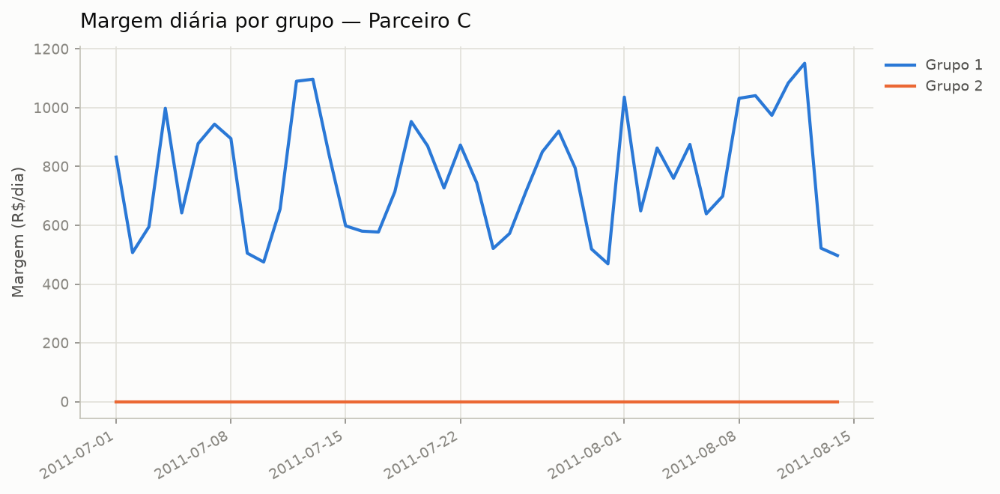

# Teste A/B — Parceiro C

## Resumo executivo

- **Decisão: manter Grupo 1** — Grupo 2 teve desempenho pior, com significância estatística (confiança alta).

## Racional

### Grupo 1 vs Grupo 2

No período comparável (45 dias pareados), Grupo 2 gerou em média R$ 772,64 de margem por dia a menos que Grupo 1 (intervalo de 95% de confiança: -R$ 832,64 a -R$ 712,65).

Próximo teste sugerido: os patamares de cashback já testados neste histórico vão até 7.0%, em passos de ~2.0% — considere testar um próximo patamar por volta de 9.0%, mantendo o incremento já validado no próprio histórico.

Do ponto de vista de risco: há 100% de chance de Grupo 1 ser melhor; se escalássemos Grupo 2 por engano, a perda esperada seria de R$ 772,72/dia.

_após correção de Benjamini-Hochberg para múltiplas comparações (t ajustado=0.0000, Wilcoxon ajustado=0.0000): diferença média de -772.64 é estatisticamente significativa._

## Ressalvas

- [CRITICO] colapso_de_volume_fim_serie (Parceiro C / Grupo 2): 'compradores' de Grupo 2 despenca nos últimos 5 dias da série: média cai de 108 para 42 (z=-2.5), e a queda não aparece nos demais grupos do mesmo teste no mesmo período — investigar antes de confiar no resultado (possível bug de instrumentação isolado ao grupo).
- [AVISO] repasse_total_de_cashback (Parceiro C / Grupo 2): Grupo 2 repassa ~100% da comissão como cashback em 100% dos dias — a margem (comissão - cashback) desse grupo é próxima de zero por desenho, não por efeito do teste; interprete a comparação de margem com essa ressalva.

## Apêndice técnico

- **Grupo 1 vs Grupo 2** (coluna: `margem`, n=45)
  - teste t pareado: estatística=-25.956, p=0.0000
  - Wilcoxon: estatística=0.000, p=0.0000
  - IC95 da diferença: (-832.64, -712.65)
  - médias: baseline=772.64, variante=0.00
  - camada bayesiana (prior de Jeffreys, posterior Student-t): P(μ>0)=0.0000, IC95 credível=(-832.64, -712.65), perda esperada de escalar=772.72, perda esperada de manter=0.00
  - correção Benjamini-Hochberg (múltiplas comparações): t ajustado=0.0000, Wilcoxon ajustado=0.0000, significativo após correção=True
  - bootstrap em bloco (2000 reamostragens, bloco=4 dias): IC95=(-843.51, -726.80), contém zero=False
